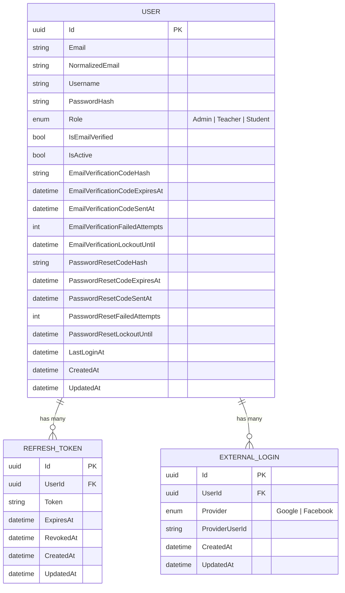
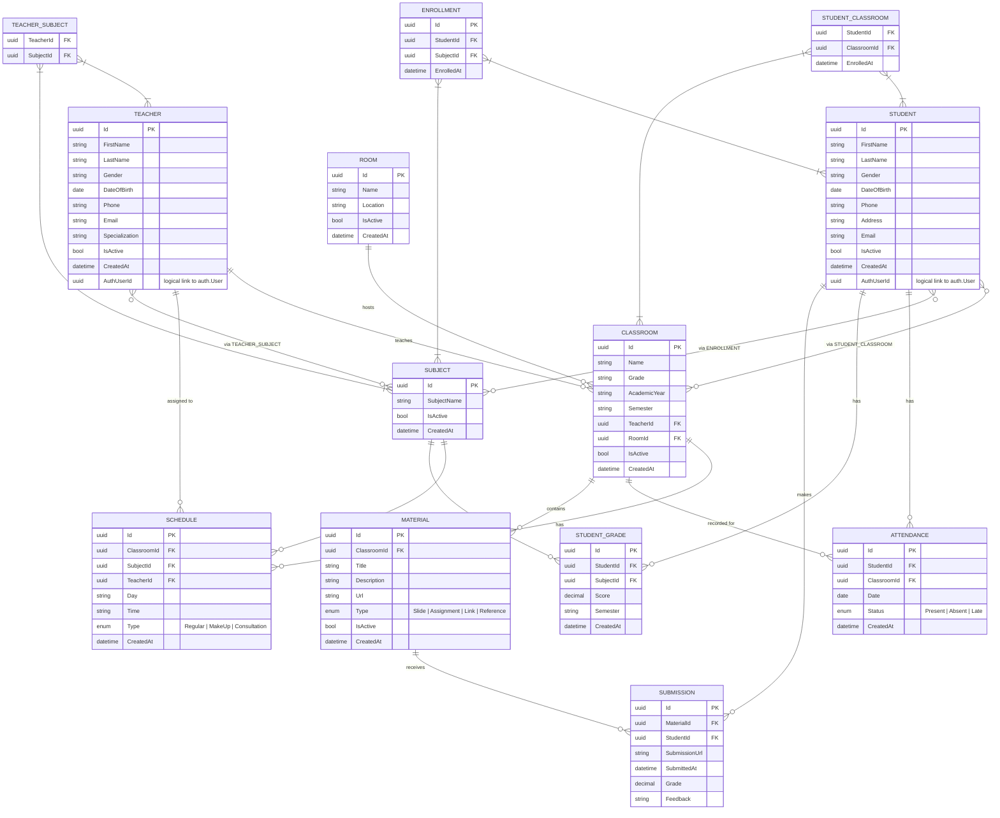

# School Management System — ERD

> This ERD covers **both microservices**: `auth-service` and `school-service`.
> Cross-service references (e.g. [AuthUserId](file:///c:/school%20management/backend/services/school-service/SchoolService/SchoolService.Domain/Entities/Teacher.cs#37-38)) are **logical links** only — no DB-level FK across services.

---

## 🔐 Auth Service

---

## 🏫 School Service

---

## 🔗 Cross-Service Relationship

| School Entity | Field       | Links To        |
|---------------|-------------|-----------------|
| [Student](file:///c:/school%20management/backend/services/school-service/SchoolService/SchoolService.Domain/Entities/Student.cs#3-63)     | [AuthUserId](file:///c:/school%20management/backend/services/school-service/SchoolService/SchoolService.Domain/Entities/Teacher.cs#37-38) | `auth.User.Id` |
| [Teacher](file:///c:/school%20management/backend/services/school-service/SchoolService/SchoolService.Domain/Entities/Teacher.cs#31-36)     | [AuthUserId](file:///c:/school%20management/backend/services/school-service/SchoolService/SchoolService.Domain/Entities/Teacher.cs#37-38) | `auth.User.Id` |

> These are **logical references only** — no FK constraint across service databases.

---

## 📋 Enum Summary

| Enum              | Values                             | Used In       |
|-------------------|------------------------------------|---------------|
| `UserRole`        | Admin, Teacher, Student            | User          |
| `ExternalAuthProvider` | Google, Facebook             | ExternalLogin |
| `MaterialType`    | Slide, Assignment, Link, Reference | Material      |
| `SessionType`     | Regular, MakeUp, Consultation      | Schedule      |
| `AttendanceStatus`| Present, Absent, Late              | Attendance    |
